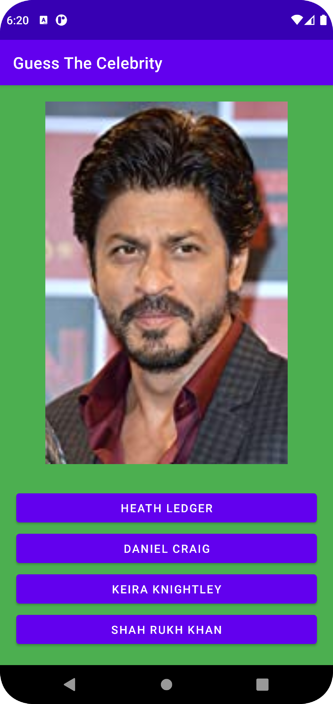
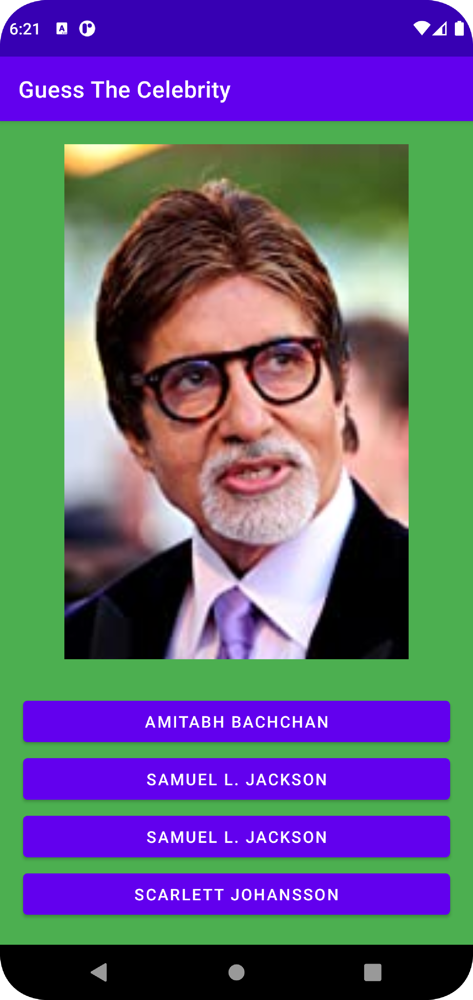
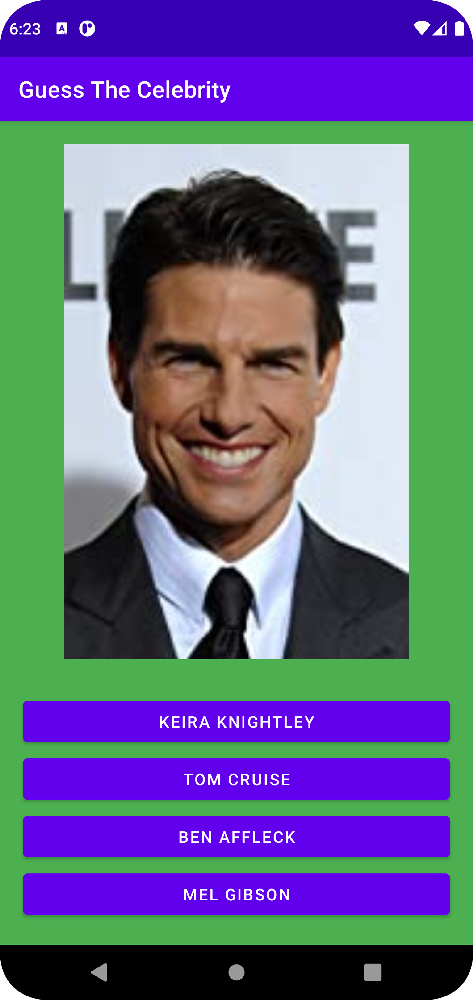
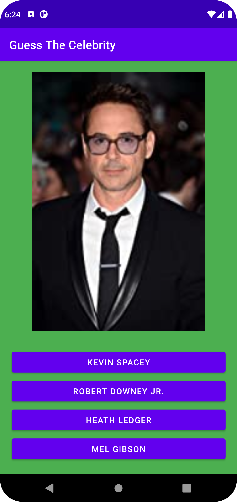

# App-Guess_The_Celebrity
It displays celebrity name along with options. We have to guess which is correct. Then it'll show whether we were correct or not. If not, it'll show the correct name. It fetches images and name from the this site. It fetches the entire site (HTML) then makes a list of urls of images and names present in the alt tag. Using those lists, it'll select random celebrity. For options, it  it stores the correct answer along with other 3 incorrect responses.

<b>Screenshots: </b>

